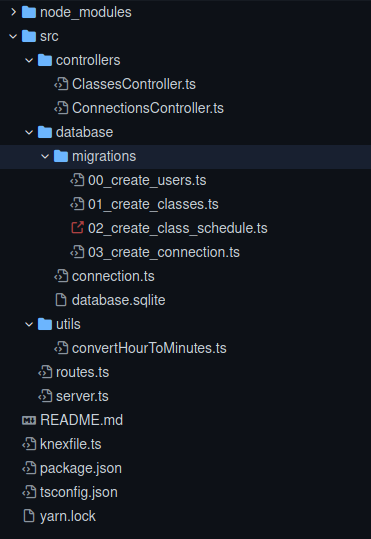

# Proffy
<p align="left">
 </img>
</p>

<p align="right">
 </img>
</p>

# Proffy Web

## :rocket: Tecnologias utilizadas

- [ReactJS](https://pt-br.reactjs.org/)
- [StyleSheet](https://reactnative.dev/docs/stylesheet)
- [typescript](https://www.typescriptlang.org/)
- [React-router-dom](https://www.npmjs.com/package/react-router-dom)
- [Hooks](https://pt-br.reactjs.org/docs/hooks-intro.html)
- [vector icons](https://icons.expo.fyi/)
- [axios](https://github.com/axios/axios)

# Proffy-mobile


## :rocket: Tecnologias utilizadas

- [React Native](https://reactnative.dev/)
- [StyleSheet](https://reactnative.dev/docs/stylesheet)
- [typescript](https://www.typescriptlang.org/)
- [Gesture handler](https://docs.swmansion.com/react-native-gesture-handler/docs/)
- [AsyncStorage](https://www.npmjs.com/package/@react-native-community/async-storage)
- [Hooks](https://pt-br.reactjs.org/docs/hooks-intro.html)
- [React navigation](https://reactnavigation.org/)
- [vector icons](https://icons.expo.fyi/)
- [axios](https://github.com/axios/axios)

# NodeJS

## Estrutura do projeto

</img>


## Rotas

- Rota para retornar o total de conexões realizadas;
- Rota para criar uma nova conexão;
- Rota para retornar as aulas;
- Rota para criar uma nova aula;


## :rocket: Tecnologias utilizadas

- [express](https://expressjs.com/)
- [knex](http://knexjs.org/)
- [typescript](https://www.typescriptlang.org/)
- [sqlite3](https://www.sqlite.org/index.html)
- [cors](https://developer.mozilla.org/pt-BR/docs/Web/HTTP/Controle_Acesso_CORS)

### Pré-requisitos

Antes de começar, você vai precisar ter instalado em sua máquina as seguintes ferramentas:
[Git](https://git-scm.com), [Node.js](https://nodejs.org/en/) e um gerenciador de pacotes [Yarn](https://yarnpkg.com/) ou [npm](https://www.npmjs.com/). 
Além disto é bom ter um editor para trabalhar com o código como [VSCode](https://code.visualstudio.com/)


### 🎲 Rodando o Back End (servidor)

```bash
# Clone este repositório
$ git clone <https://github.com/Luciano-Ferreira/Proffy-NodeJS.git>

# Acesse a pasta do projeto no terminal/cmd
$ cd Proffy-NodeJS

# Instale as dependências
$ yarn 
ou
$ npm install

# Execute a aplicação em modo de desenvolvimento
$ yarn start
ou
$ npm run start

# O servidor inciará na porta:3333 - acesse <http://localhost:3333>
```
